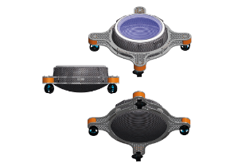

# Navigation and control of [H20mni-X](https://labust.fer.hr/labust/about/equipment/h2omni-x) maritime robot

### Course : [Marine Robotics](https://www.fer.unizg.hr/en/course/marrob)

The goal of the project is the implementation of the navigation design process,
guidance and control (NGC) algorithms for H20mni-x maritime robot. H20mni-X is an autonomous surface vehicle (ASV) that weighs about 20 kg and is placed in a pool that is monitored by localization cameras. H20mniX contains sensors such as a magnetometer and accelerometer and is equipped with ROS system for communication with Simulink model. The project consists of a simulation and a practical part.
<p align="center">

</p>
<p align="center">
Figure : H20mni-X
</p>

#### Seminar Documentation can be found in the `Documentation/Seminar - Simulaton and Practical parts.pdf` file

## Implementation order

* Compensation of thruster nonlinearity - compensation of thruster nonlinearity ensures required thruster forces
* Control allocation - distribution of control, i.e. mapping of the generalized vector of forces and moments τ into individual thruster force requirements.
* PI heading controller - the heading controller needed to control the angle of the H2OmniX
* PID positioning controller - controller for placing the H2OmniX at the desired location in the pool.


## Execution

In the `Simulation` and `Matlab` run the following files from the `Simulation` folder:

### 1. Load the required libraries with :
```
MarineRoboticsLib.slx
```
### 2. Input of desired position (x,y,yaw) and regulator parameters
```
Regulator.m
```
3. Simulink model - start by pressing the Run button and visualize the results using Scope blocks
```
main.slx
```


## Results

The results can be found in the `Documentation/seminar.pdf` report.

//TODO: translate the report to English


## Credits

#### [&copy; Faculty of Electrical Engineering and Computing, University of Zagreb, 2024](https://www.fer.unizg.hr/)

#### [&copy; Laboratory for Underwater Systems and Technologies (LABUST)](https://labust.fer.hr/)

&NewLine;

Contributors names and contact info

Author|GitHub | e-mail
| :--- | :---: | :---:
Enio Krizman  | [@kr1zzo](https://github.com/kr1zzo) | enio.krizman@fer.hr
Pero Drobac  | [@PeteHeat08](https://github.com/PeteHeat08) | pero.drobac@fer.hr
Lovre Grašo  | [@lovregraso](https://github.com/lovregraso) | lovre.graso@fer.hr

Academic title | Lecturer
| :--- | :---: 
Doc. Dr. Sc. | Đula Nađ  
Prof. Dr. Sc. | Nikola Mišković 

